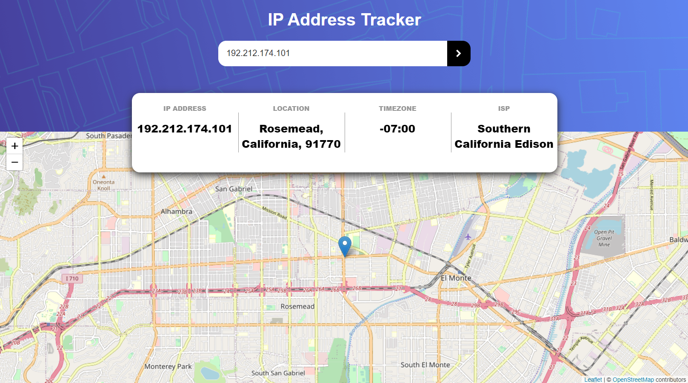
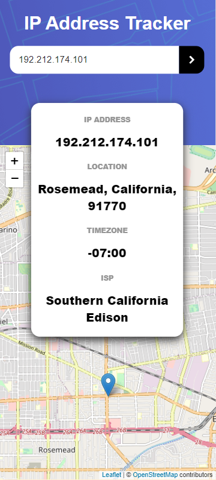

# Frontend Mentor - IP address tracker solution

[](https://app.netlify.com/sites/ip-address-tracker-next/deploys)

This is a solution to the [IP address tracker challenge on Frontend Mentor](https://www.frontendmentor.io/challenges/ip-address-tracker-I8-0yYAH0). Frontend Mentor challenges help you improve your coding skills by building realistic projects.

## Table of contents

- [Overview](#overview)
  - [The challenge](#the-challenge)
  - [Screenshot](#screenshot)
  - [Links](#links)
- [My process](#my-process)
  - [Built with](#built-with)
  - [What I learned](#what-i-learned)
  - [Continued development](#continued-development)
  - [Useful resources](#useful-resources)
- [Author](#author)
- [Acknowledgments](#acknowledgments)

**Note: Delete this note and update the table of contents based on what sections you keep.**

## Overview

### The challenge

Users should be able to:

- View the optimal layout for each page depending on their device's screen size
- See hover states for all interactive elements on the page
- See their own IP address on the map on the initial page load
- Search for any IP addresses or domains and see the key information and location

### Screenshots

#### Desktop



#### Mobile



### Links

- Solution URL: [https://github.com/james-work-account/ip-address-tracker-next](https://github.com/james-work-account/ip-address-tracker-next)
- Live Site URL: [https://ip-address-tracker-next.netlify.app/](https://ip-address-tracker-next.netlify.app/)

## My process

### Built with

- [Typescript](https://www.typescriptlang.org/) - Typed JavaScript (I'm a Scala developer normally so typed languages are much more natural to me - trying to become more familiar with Typescript)
- [Next.js](https://nextjs.org/) - React framework
- [SCSS](https://sass-lang.com/) - CSS Extension

### What I learned

This was my first time using Leaflet.JS and IPIFY. Both were a pain to integrate for different reasons:

- IPIFY throws CORS issues when called from a browser. This is why I chose to build the website in Next.JS rather than standard React - Next allows you to create API routes which sit on the server rather than the browser, so I could put calls to IPIFY in an API route and avoid having to deal with CORS entirely. Also, in the last few months Netlify have been adding more and more support for NEXT.js so even though it's a frontend framework I can deploy server-side routes without having to deal with a separate server hosted on Heroku or something.
- The React implementation of Leaflet is a bit wonky. Firstly, it references the browser `window` without checking whether it exists or not - therefore I used the Next dynamic component feature (see snippet below) to be able to avoid SSR rendering the map component. Secondly, most of the Props in this React Leaflet library are immutable to I had to make a fairly hacky workaround to be able to update the map on route changes ([see here](./components/Map.tsx)). It's pretty ugly but it works alright.

```js
const Map = dynamic(() => import("../components/Map"), { ssr: false });
```

### Continued development

My solution doesn't look exactly like the brief - possibly I'd like to update it to get it more pixel-perfect. Honestly I'd like to find less hacky ways to implement the Map.tsx file - things like the separate style tag to force it to have a variable-yet-set height, a less bodgy way to update the map when coordinates change, etc. Cleaner, more sensible code is more important to me than getting the site pixel perfect.

### Useful resources

- [Changing the map center when the center state changes](https://stackoverflow.com/questions/64665827/react-leaflet-center-attribute-does-not-change-when-the-center-state-changes/64667351#64667351)
- [Using a custom Hook to detect window size and keep track when window size changes](https://stackoverflow.com/questions/63406435/how-to-detect-window-size-in-next-js-ssr-using-react-hook/63408216#63408216)
- [Dynamic imports with Next.JS to avoid "window is not defined" errors in react-leaflet](https://nextjs.org/docs/advanced-features/dynamic-import#with-no-ssr)

## Author

- Frontend Mentor - [@james-work-account](https://www.frontendmentor.io/profile/james-work-account)
- GitHub - [@james-work-account](https://github.com/james-work-account)
